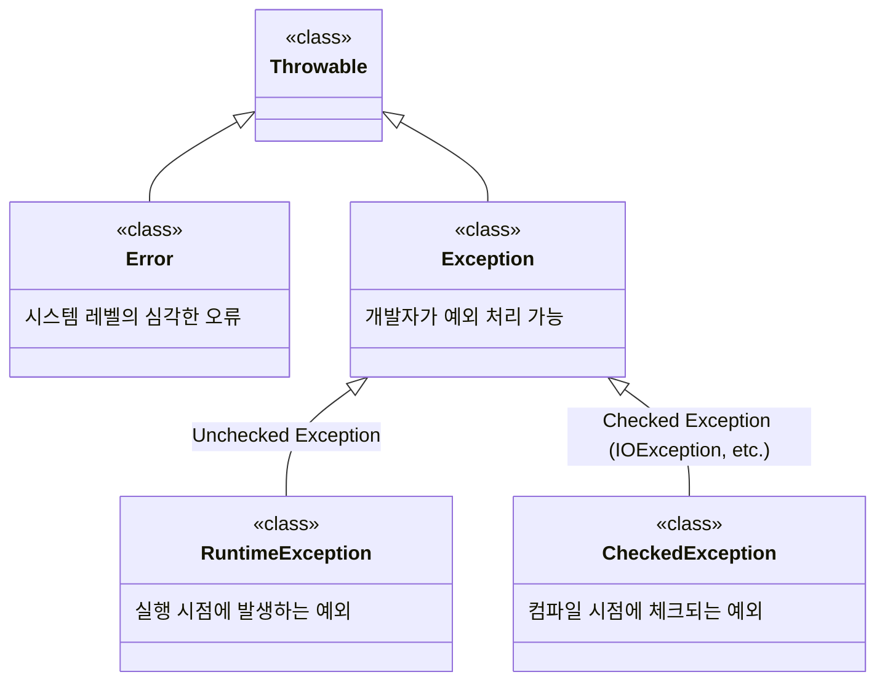
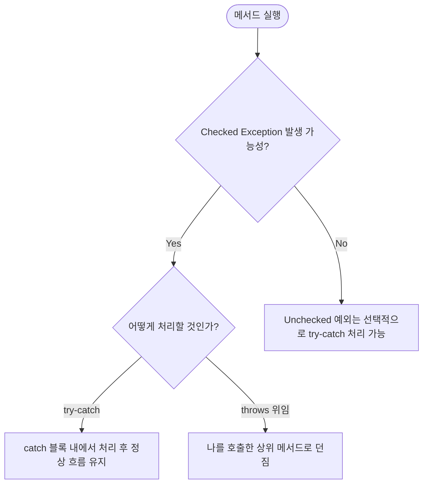

# Java 예외 처리 기초: Checked vs Unchecked Exception

이 자료는 [Solution01.java](file:///Users/baegseungho/IdeaProjects/260626_ex/src/Solution01.java)에 구현된 예외 처리의 핵심 개념을 바탕으로 작성된 초심자용 가이드 및 면접 대비용 요약 자료입니다.

---

## 1. 초심자용 가이드 (For Beginners)

### 💻 예외(Exception)란 무엇인가요?
프로그램을 실행하다 보면 개발자가 예상하지 못한 일이나 제어할 수 없는 상황이 발생합니다. 예를 들어, 어떤 수를 `0`으로 나누려고 하거나, 인터넷 연결이 갑자기 끊겨 데이터를 전송할 수 없는 상황 등이 있습니다. 자바는 이러한 문제를 **'예외(Exception)'**라는 객체로 다룹니다.

### 📊 Java 예외 클래스의 가계도 (계층 구조)
자바의 모든 예외와 에러는 `Throwable` 클래스를 상속받습니다. 그 구조는 다음과 같이 나뉩니다.



* **Error (에러)**: 메모리 부족(`OutOfMemoryError`) 등 프로그램이 스스로 복구할 수 없는 심각한 시스템 문제입니다.
* **Exception (예외)**: 개발자가 코드로 수습할 수 있는 문제로, 크게 두 종류로 나뉩니다.

---

### 🔍 Checked Exception vs Unchecked Exception

자바 예외는 **"컴파일러가 강제로 예외 처리를 확인(Check)하는가?"**에 따라 두 가지로 구분됩니다.

#### 1) Unchecked Exception (실행 예외)
* **정의**: `RuntimeException`을 상속받는 예외들입니다.
* **특징**: 프로그램 실행 중에 발생하며, 컴파일러가 예외 처리를 강제하지 않습니다.
* **코드 예시**: `Solution01.java`에서 0으로 나눴을 때 발생하는 `ArithmeticException`이 대표적입니다.
  ```java
  int b = 0;
  System.out.println(10 / b); // RuntimeException 발생 (ArithmeticException)
  ```

#### 2) Checked Exception (컴파일 예외)
* **정의**: `RuntimeException`을 상속받지 않고, `Exception`을 직접 상속받는 예외들입니다.
* **특징**: 컴파일 시점에 자바 컴파일러가 예외 처리가 되어 있는지 엄격하게 확인합니다. 예외 처리를 하지 않으면 컴파일 에러가 발생하여 빌드조차 되지 않습니다.
* **코드 예시**: 네트워크 요청을 처리하는 `HttpClient` API 사용 시 발생하는 `IOException` 등이 있습니다.
  ```java
  // 예외 처리를 하지 않으면 빨간 줄(컴파일 에러)이 생김
  HttpClient client = HttpClient.newHttpClient();
  client.send(request, response); // IOException, InterruptedException 대응 필요
  ```

---

### 🛠 예외를 다루는 두 가지 방법
예외가 발생할 가능성이 있는 코드를 다룰 때는 다음 두 가지 방법 중 하나를 선택해야 합니다.

1. **`try-catch`로 직접 해결하기**: 예외가 발생하면 즉시 처리하여 프로그램을 정상 흐름으로 돌려놓습니다.
2. **`throws`로 위임하기 (폭탄 돌리기)**: 내가 처리하지 않고, 이 메서드를 호출하는 위쪽 메서드(상위 레벨)에게 예외 처리를 미룹니다.



---

## 2. 면접 대비용 가이드 (For Interview)

### 📌 Q1. Checked Exception과 Unchecked Exception의 차이를 설명해 주세요.

| 비교 항목 | Checked Exception | Unchecked Exception (RuntimeException) |
| :--- | :--- | :--- |
| **상속 클래스** | `java.lang.Exception` 직접 상속 (단, `RuntimeException` 제외) | `java.lang.RuntimeException` 상속 |
| **컴파일러 체크** | **필수** (체크하지 않으면 컴파일 에러 발생) | **선택** (명시적인 처리 강제 없음) |
| **트랜잭션 롤백 여부** | 기본적으로 **롤백 안 됨** (Spring 프레임워크 기준) | 기본적으로 **롤백 됨** |
| **예외 발생 시점** | 컴파일 타임 (Compile-time) | 런타임 (Runtime) |
| **대표적인 예시** | `IOException`, `SQLException`, `ClassNotFoundException` | `NullPointerException`, `ArithmeticException`, `IllegalArgumentException` |

> [!TIP]
> **면접 답변 팁**: "가장 큰 차이점은 **자바 컴파일러의 강제성 여부**입니다. Checked 예외는 컴파일러가 강제하므로 예측 가능한 외부 시스템(DB, 파일 I/O, 네트워크 등)과의 통신 시 안전 장치로 주로 쓰이고, Unchecked 예외는 주로 개발자의 실수나 잘못된 인풋(`IllegalArgumentException` 등)으로 발생하는 런타임 오류를 의미합니다."

---

### 📌 Q2. 예외 처리에서 `throws` 키워드는 언제 사용하며 어떤 의미인가요?
* **답변**: `throws`는 메서드 시그니처 뒤에 선언하여 **"이 메서드 내에서 특정 예외가 발생할 수 있으며, 이에 대한 처리는 나를 호출하는 호출자(Caller)에게 위임한다"**는 것을 선언하는 키워드입니다.
* **주의점**: 예외 처리를 계속해서 `throws`로 위임하여 프로그램 최상단인 `main` 메서드까지 위임하게 되면, 예외 발생 시 JVM이 예외 스택 트레이스를 출력하고 프로그램을 강제로 종료하게 됩니다. 따라서 적절한 계층(컨트롤러 혹은 서비스 계층)에서 반드시 `try-catch`로 예외를 가로채 흐름을 제어해주어야 합니다.

---

### 📌 Q3. 왜 Checked Exception은 Spring Framework에서 기본적으로 트랜잭션 롤백(Rollback)이 안 될까요?
* **답변**: Spring의 `@Transactional`은 기본적으로 **예상치 못한 예외(Unchecked Exception 및 Error)**가 발생했을 때만 트랜잭션을 롤백하도록 설계되어 있습니다. 
* Checked Exception은 컴파일러 단계에서 개발자가 인지하고 이에 대한 대안 비즈니스 로직(예: 다른 복구 시나리오 실행 등)을 작성할 수 있다고 가정하기 때문에, 롤백을 기본 동작으로 삼지 않습니다. 만약 Checked Exception에서도 트랜잭션을 롤백하고 싶다면 `@Transactional(rollbackFor = Exception.class)`처럼 명시적으로 설정을 추가해 주어야 합니다.
