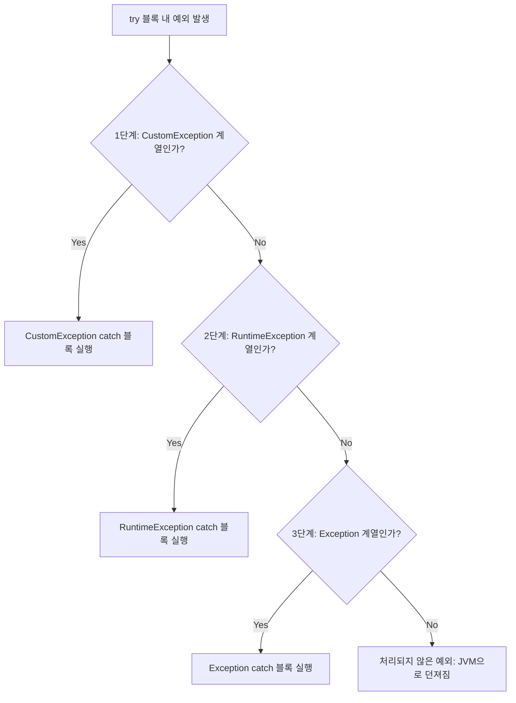

# 커스텀 예외 설계와 다중 예외 처리 (Multi-Catch)

이 자료는 [Solution02.java](file:///Users/baegseungho/IdeaProjects/260626_ex/src/Solution02.java)에 구현된 예외 처리의 핵심 개념을 바탕으로 작성된 초심자용 가이드 및 면접 대비용 요약 자료입니다.

---

## 1. 초심자용 가이드 (For Beginners)

### 🧩 왜 나만의 예외(Custom Exception)를 만드나요?
자바는 이미 `NullPointerException`, `IllegalArgumentException` 등 다양한 예외를 제공합니다. 하지만 실제 서비스를 만들다 보면 **"우리 서비스만을 위한 에러 상황"**을 정의해야 할 때가 있습니다.
* 예: 로그인 시 비밀번호가 틀림 (`PasswordMismatchException`), 결제 시 잔액이 부족함 (`InsufficientBalanceException`)
* 커스텀 예외를 만들면 **에러의 이름을 통해 직관적으로 어떤 비즈니스 오류가 발생했는지** 파악할 수 있고, 내부에 에러 코드(Error Code) 같은 커스텀 필드를 추가해 클라이언트에 정교한 정보를 전달할 수 있습니다.

### 🛠 커스텀 예외 만들기
커스텀 예외 또한 Checked 예외로 만들지, Unchecked 예외로 만들지에 따라 부모 클래스가 달라집니다.

```java
// 1. Checked Custom Exception (Exception 상속)
class CustomException extends Exception {
    public final int code;
    
    CustomException() {
        super("기본 에러 메시지");
        this.code = 100;
    }
    CustomException(String message) {
        super(message);
        this.code = 101;
    }
}

// 2. Unchecked Custom Exception (RuntimeException 상속)
class UncheckedCustomException extends RuntimeException {
    // 생략 시 부모의 생성자 자동 호출 및 컴파일러 예외 체크 제외
}
```

---

### 📥 다중 catch 블록의 룰: "깔때기 법칙"
여러 개의 예외가 발생할 수 있는 코드는 `try` 블록 하나에 `catch` 블록을 여러 개 붙여 처리할 수 있습니다. 이때 가장 중요한 룰은 **"좁은 범위(자식 예외)부터 시작해서 넓은 범위(부모 예외) 순으로 catch해야 한다"**는 것입니다.



* **부모 클래스가 위에 있으면 안 되는 이유**: 만약 최상위 부모인 `Exception`이 가장 첫 번째 `catch` 블록에 위치한다면, 모든 예외가 첫 번째 블록에 걸려버립니다. 아래에 있는 자식 예외 catch 블록은 절대 도달할 수 없는 코드가 되기 때문에 자바 컴파일러가 에러(`already been caught`)를 냅니다.

---

## 2. 면접 대비용 가이드 (For Interview)

### 📌 Q1. 다중 catch 블록을 작성할 때 정렬 순서의 규칙과 컴파일 에러가 발생하는 조건에 대해 설명해 주세요.
* **답변**: 다중 `catch` 블록은 상속 관계가 존재할 경우 반드시 **하위 클래스(구체적인 예외)를 위에, 상위 클래스(광범위한 예외)를 아래에** 배치해야 합니다. 
* 자바 컴파일러는 위에서부터 순서대로 예외 타입을 매칭하며 내려오기 때문에, 상위 클래스 예외가 먼저 선언되면 하위 클래스 예외 블록은 영원히 도달할 수 없는 데드 코드(Dead Code)가 됩니다. 이 경우 컴파일러가 이를 감지하여 `Exception 'XXX' has already been caught` 컴파일 에러를 발생시킵니다.

---

### 📌 Q2. Java 7에서 도입된 Multi-catch (`catch (A | B e)`)의 특징과 주의점은 무엇인가요?
* **답변**: Java 7부터는 파이프 기호(`|`)를 사용하여 여러 예외를 한 번에 catch할 수 있습니다. 
  ```java
  catch (CustomException | UncheckedCustomException e) { ... }
  ```
* **주의점(상속 관계 금지)**: 나열된 예외 클래스들 사이에 **상속 관계**가 있으면 안 됩니다. 예를 들어 `catch (Exception | CustomException e)` 와 같이 부모-자식 관계의 예외를 동시에 나열하면 컴파일 에러가 발생합니다. (어차피 부모 클래스 하나만 써도 다 커버되기 때문입니다.)
* **변수의 불변성(Implicitly Final)**: Multi-catch 블록 내에서 예외 매개변수 `e`는 묵시적으로 `final` 상태가 되므로, catch 블록 내부에서 `e = new CustomException();`과 같이 다른 객체를 재할당할 수 없습니다.

---

### 📌 Q3. 예외 체이닝(Exception Chaining) 혹은 예외 되던지기(Re-throwing)를 할 때 왜 원본 예외를 담아야 하나요?
* **실행 예시**:
  ```java
  catch (CustomException e) {
      throw new RuntimeException(e); // 원본 예외 e를 생성자에 전달!
  }
  ```
* **답변**: 하위 레이어에서 발생한 예외를 상위 레이어로 전달할 때 Checked 예외를 Unchecked 예외로 전환(예외 번역)하거나 추가 정보를 얹어서 다시 던지곤 합니다. 이때 원본 예외(`e`)를 새로 생성할 예외의 생성자(Cause)로 넘겨주지 않으면, **실제 에러가 최초에 왜 발생했는지에 대한 근본적인 원인(Root Cause)과 스택 트레이스 정보가 소실**됩니다. 시스템 디버깅 시 치명적인 장애물이 되므로 반드시 원본 예외를 파라미터로 넘겨 체이닝을 유지해야 합니다.
