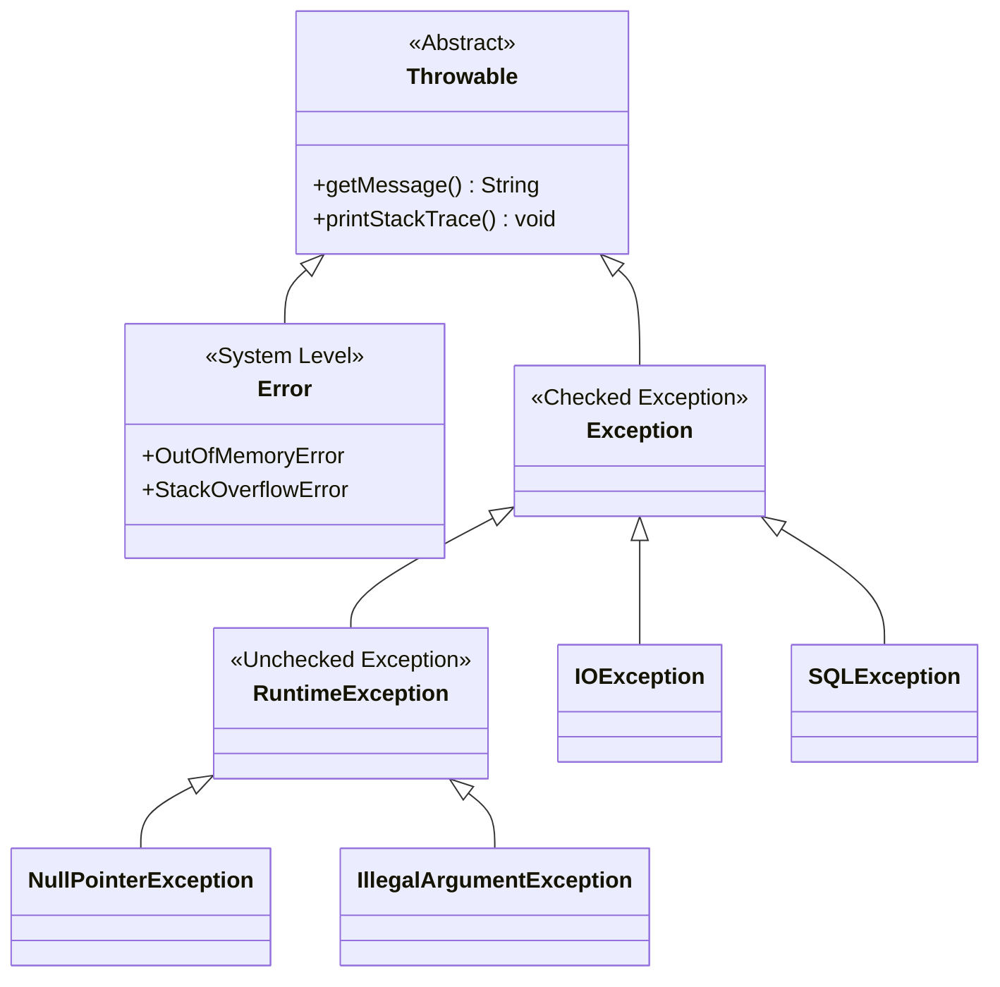
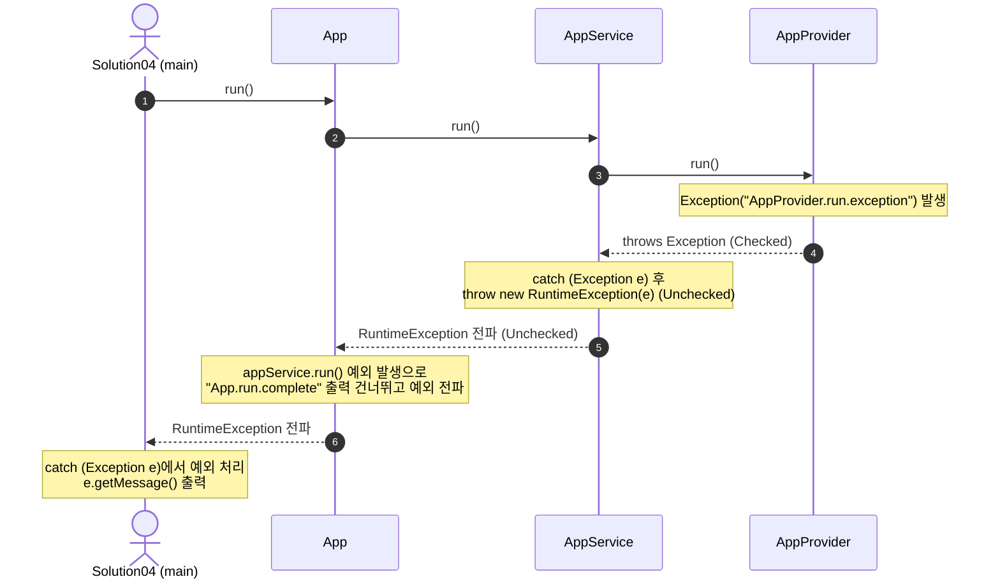

# 자바 예외 처리와 예외 전환 (Exception Handling & Wrapping)

이 자료는 [Solution04.java](file:///Users/baegseungho/IdeaProjects/260626_ex/src/Solution04.java) 및 [oop 패키지](file:///Users/baegseungho/IdeaProjects/260626_ex/src/oop) 내부 코드의 구조를 기반으로 자바 예외 처리의 핵심 이론을 정리한 문서입니다. 초심자용 가이드와 면접 대비용 내용으로 나뉘어 있습니다.

---

## 1. 초심자용 가이드 (For Beginners)

### 🚨 예외(Exception)란 무엇인가요?
프로그램을 실행하다 보면 예기치 못한 상황(네트워크 끊김, 파일 찾을 수 없음, 잘못된 입력 등)이 발생할 수 있습니다. 자바는 이를 **'예외(Exception)'**라는 객체로 표현하여 관리합니다.

#### 자바 예외 클래스의 계층 구조 (Mermaid)


* **Error**: JVM 내부 메모리 부족(OOM) 등 프로그램 내부에서 해결할 수 없는 치명적인 시스템 문제입니다.
* **Checked Exception**: 컴파일러가 예외 처리 여부를 강제로 확인하는 예외입니다. (처리하지 않으면 컴파일 에러 발생)
* **Unchecked (Runtime) Exception**: 실행 중에 발생하는 예외로, 컴파일러가 확인하지 않습니다.

---

### 📊 Checked Exception vs Unchecked Exception 비교

| 구분 | Checked Exception | Unchecked (Runtime) Exception |
| :--- | :--- | :--- |
| **상속 클래스** | `Exception` 클래스 상속 (단, `RuntimeException` 계열 제외) | `RuntimeException` 클래스 상속 |
| **컴파일 시점 검증** | **필수** (예외 처리를 하지 않으면 컴파일이 안 됨) | **선택** (예외 처리를 강제하지 않음) |
| **처리 방법** | `try-catch`로 직접 해결하거나 `throws` 선언 | 굳이 `throws`로 던지지 않아도 알아서 상위로 전파됨 |
| **대표 클래스** | `IOException`, `SQLException`, `ClassNotFoundException` | `NullPointerException`, `IllegalArgumentException`, `IndexOutOfBoundsException` |
| **예시 코드 상황** | 파일 읽기/쓰기, 데이터베이스 조회, 네트워크 연결 등 | 0으로 나누기, null 객체 접근, 배열 범위 초과 등 |

---

### 🔄 예외 전파와 흐름 분석 (Mermaid & 설명)

[Solution04.java](file:///Users/baegseungho/IdeaProjects/260626_ex/src/Solution04.java)에서는 다음과 같이 호출이 일어납니다.

```
Solution04 (main) ──> App.run() ──> AppService.run() ──> AppProvider.run()
```

#### 호출 및 예외 전달 시퀀스 다이어그램


#### 코드 기반 상세 흐름 분석
1. **[AppProvider.java](file:///Users/baegseungho/IdeaProjects/260626_ex/src/oop/AppProvider.java) (예외 발생)**
   ```java
   public void run() throws Exception {
       System.out.println("AppProvider.run");
       throw new Exception("AppProvider.run.exception"); // Checked Exception 생성 및 던지기
   }
   ```
   * `Exception`을 상속받은 객체를 던지므로 메서드 시그니처에 `throws Exception`을 반드시 명시해야 합니다.

2. **[AppService.java](file:///Users/baegseungho/IdeaProjects/260626_ex/src/oop/AppService.java) (예외 전환 / wrapping)**
   ```java
   public void run() { // 💡 더 이상 throws Exception이 없음
       System.out.println("AppService.run");
       try {
           appProvider.run();
       } catch (Exception e) {
           System.out.println("e.getClass() = " + e.getClass());
           System.out.println("AppService.run.exception.catch");
           System.out.println("rethrow");
           throw new RuntimeException(e); // 💡 Checked -> Unchecked 예외로 전환(Wrapping)
       }
       System.out.println("AppService.run.complete"); // ❌ 예외 발생으로 실행되지 않음
   }
   ```
   * `AppProvider`로부터 전달받은 Checked Exception을 잡은 뒤, 이를 `RuntimeException` 안에 담아 다시 던집니다.
   * **원인 예외 전달 (Chaining)**: `new RuntimeException(e)` 생성자를 사용하면 `e`(원래 발생한 checked 예외)가 새로운 런타임 예외의 '원인(Cause)'으로 지정되어 예외 히스토리가 유지됩니다.

3. **[App.java](file:///Users/baegseungho/IdeaProjects/260626_ex/src/oop/App.java) (예외 무시 및 통과)**
   ```java
   public void run() throws Exception {
       System.out.println("App.run");
       appService.run(); // RuntimeException이 발생하므로 catch 블록이 없으면 메서드 밖으로 방출됨
       System.out.println("App.run.complete"); // ❌ 실행 안 됨
   }
   ```
   * 런타임 예외는 컴파일러가 별도 처리를 검증하지 않으므로, `throws`에 선언하지 않아도 상위(호출자)로 계속 올라갑니다.

4. **[Solution04.java](file:///Users/baegseungho/IdeaProjects/260626_ex/src/Solution04.java) (예외 최종 처리)**
   ```java
   try {
       app.run();
   } catch (Exception e) {
       System.out.println("e.getMessage() = " + e.getMessage());
       // e.getMessage() = java.lang.Exception: AppProvider.run.exception
   }
   ```
   * `App`에서 전파된 `RuntimeException`을 `catch (Exception e)`로 잡아 처리합니다.
   * `RuntimeException`을 생성할 때 원인 예외(`e`)를 생성자에 넘겨주었기 때문에, `e.getMessage()`를 호출하면 런타임 예외 자체의 상세 정보(감싸진 원인 예외의 클래스명과 메시지)인 `java.lang.Exception: AppProvider.run.exception`이 정상적으로 출력됩니다.

---

## 2. 면접 대비용 가이드 (For Interview)

### 📌 Q1. Checked Exception과 Unchecked Exception의 차이와 각각 어떨 때 사용해야 하나요?
* **답변**: 
  * **Checked Exception**은 프로그램 외부 요인(네트워크 끊김, 파일 미존재 등)에 의해 예외가 발생할 가능성이 높으며, 코드가 이를 인지하고 적절히 복구(Retry, 대체 파일 사용 등)할 수 있는 예외일 때 정의합니다. 컴파일 시점에 체크되므로 안전망 역할을 합니다.
  * **Unchecked Exception**은 프로그래머의 실수(NPE, 잘못된 인자 전달 등)나 복구가 불가능한 시스템 오류 등 애플리케이션 흐름 상 더 이상 처리가 불가능한 상황에 주로 사용됩니다.
  * **최근 실무 흐름**: 대부분의 현대 프레임워크(Spring 등)와 라이브러리는 가급적 **Unchecked Exception**을 사용합니다. Checked Exception을 과도하게 사용하면 호출하는 상위 메서드마다 `throws`를 선언해주어야 하거나, 불필요한 예외 복구 코드로 인해 비즈니스 코드가 지저분해지는 **예외 선언 오염(Signature Pollution)** 문제가 발생하기 때문입니다.

---

### 📌 Q2. 예외 전환(Exception Wrapping/Chaining)이란 무엇이며 왜 중요합니까?
* **답변**: 예외 전환은 하위 계층에서 발생한 특정 기술에 종속적인 Checked Exception(예: `SQLException`, `IOException`)을 상위 계층이 다루기 쉬운 범용적인 Unchecked Exception(예: `RuntimeException`을 상속한 커스텀 예외)으로 포장하여 상위 계층으로 던지는 패턴입니다.
* **이점**:
  1. **계층 간 디커플링(Decoupling)**: 서비스 계층이 특정 데이터베이스 기술의 예외(`SQLException`)나 파일 API 예외(`IOException`)에 의존하지 않게 만듭니다. 기술이 변경(예: JPA로 전환)되더라도 서비스 계층 코드를 수정할 필요가 없습니다.
  2. **메서드 시그니처 정돈**: 수많은 메서드에 `throws SQLException`과 같은 checked 예외 선언을 주렁주렁 달고 다니지 않아도 되므로, 코드 가독성과 가용성이 높아집니다.
  3. **예외 히스토리 보존 (Chaining)**: 새로운 예외로 바꿀 때 생성자 매개변수로 원인 예외(`Throwable cause`)를 넘겨주지 않으면, 실제 에러가 발생한 지점의 stack trace를 잃어버리는 심각한 장애 분석 지연을 겪게 됩니다. `throw new RuntimeException(e)`과 같이 체이닝을 해주어야만 루트 원인(Root Cause)을 정확히 찾을 수 있습니다.

---

### 📌 Q3. 실무 애플리케이션 아키텍처(Layered Architecture)에서 이상적인 예외 처리 전략은 무엇인가요?
* **답변**: 
  * 하위 계층(Repository, API Client 등)에서는 발생하는 세부적인 Checked Exception을 적절한 **런타임 예외(보통 커스텀 예외)로 래핑하여 상위로 전파**시킵니다.
  * 서비스 계층에서는 특별한 복구 로직이 필요한 경우에만 예외를 catch하고, 그렇지 않다면 그대로 통과시킵니다.
  * 최종적으로 **프레젠테이션 계층(Controller, 또는 스프링의 `@ControllerAdvice` / `@ExceptionHandler`)**에서 통합 예외 처리기를 두어 전역(Global)으로 예외를 가로챕니다.
  * 이렇게 가로챈 예외의 정보를 바탕으로 클라이언트에게는 적절한 HTTP 상태 코드(예: 400 Bad Request, 500 Internal Server Error)와 기획적으로 조율된 에러 메시지(예: "존재하지 않는 회원 정보입니다.")를 전달하고, 서버 콘솔 및 로그 파일에는 장애 추적을 위해 **전체 Stack Trace와 부가 정보**를 로깅합니다.

```mermaid
graph TD
    Client[Client / View]
    Controller[Presentation Layer<br/>Global Exception Handler]
    Service[Service Layer<br/>Business Logic]
    Repository[Data Access Layer]

    Client -- Request --> Controller
    Controller -- Call --> Service
    Service -- Query --> Repository

    Repository -- SQLException 발생 --> Service
    Note over Service: Checked -> Unchecked 예외 전환<br/>(예외 체이닝으로 원인 보존)
    Service -- Unchecked Exception 던짐 --> Controller
    Note over Controller: @ExceptionHandler가 가로챔<br/>1. 시스템 에러 로깅 (Stack Trace)<br/>2. 유저용 에러 메시지로 변환
    Controller -- 400/500 JSON Error Response --> Client
```

---

### 📌 Q4. `e.printStackTrace()`를 실무에서 쓰면 안 되는 이유와 올바른 대안은 무엇인가요?
* **답변**: 
  * **콘솔 리다이렉션으로 인한 병목**: `e.printStackTrace()`는 에러 정보를 `System.err`(표준 에러 스트림)로 출력합니다. WAS(Tomcat 등) 환경에서는 콘솔 출력이 동기식(Synchronous) 인터셉트에 의해 파일로 쓰이거나 락(Lock)이 발생할 수 있어, 심각한 성능 저하의 원인이 됩니다.
  * **로그 소실 및 관리 불가능**: 로그 출력 포맷팅(시간, 스레드명, 클래스명 등)을 지정할 수 없고, 로그 레벨(INFO, WARN, ERROR) 제어가 불가능하여 프로덕션 환경의 로그 서버 수집 대상에서 누락되기 쉽습니다.
  * **보안 취약점**: stack trace 전체가 정제되지 않고 클라이언트에게 직접 노출될 경우, 시스템의 내부 디렉터리 구조, 클래스명, 프레임워크 버전, 데이터베이스 스키마 정보 등이 유출되는 취약점이 생니다.
  * **대안**: `SLF4J` 인터페이스와 `Logback`, `Log4j2` 같은 로깅 프레임워크를 사용하고, 반드시 `log.error("Description message", e);` 형태로 던져주어야 합니다. (이때 마지막 인자로 예외 객체 `e`를 그대로 넘겨주어야 로깅 라이브러리가 스택 트레이스 전체를 분석하여 안전하고 포맷화된 방식으로 남겨줍니다.)
