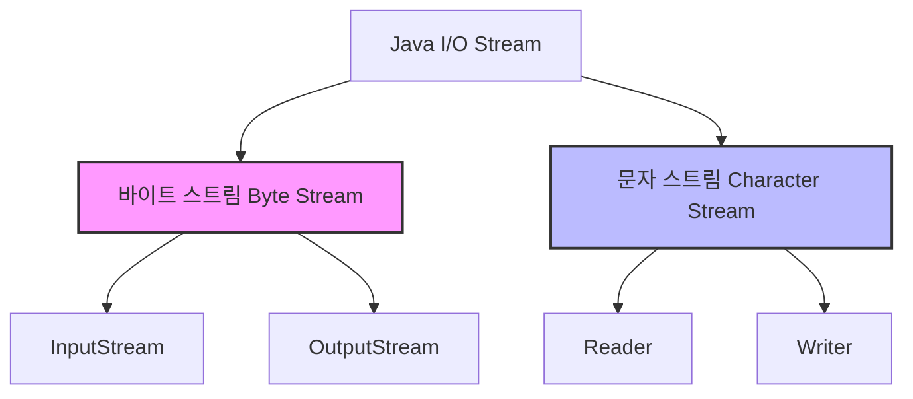
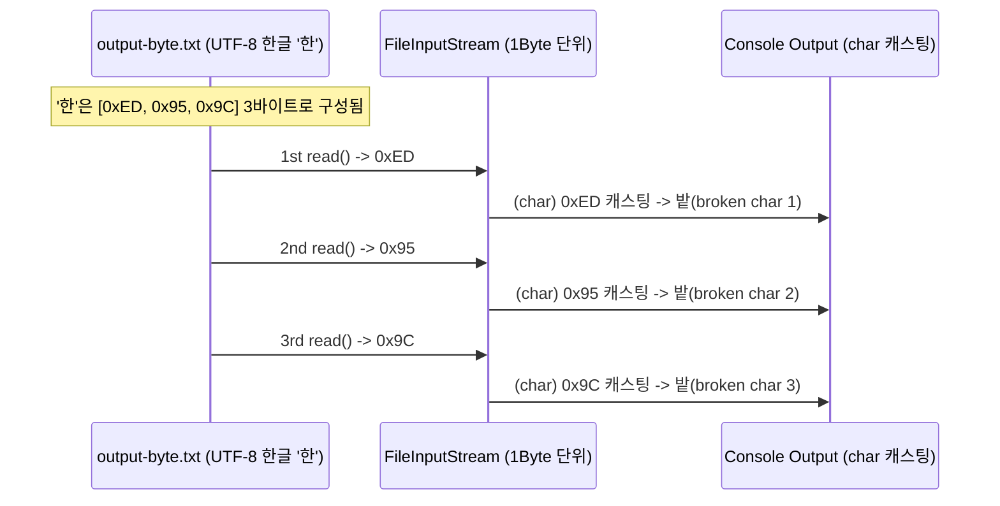

# 자바 I/O 스트림: 바이트 스트림과 문자 스트림

이 자료는 [Solution05.java](file:///Users/baegseungho/IdeaProjects/260626_ex/src/Solution05.java)의 코드를 바탕으로 자바의 입출력(I/O) 스트림 개념을 정리한 문서입니다. 초심자용 가이드와 면접 대비용 내용으로 구성되어 있습니다.

---

## 1. 초심자용 가이드 (For Beginners)

### 🌊 스트림(Stream)이란 무엇인가요?
자바에서 **스트림(Stream)**이란 데이터가 한 곳에서 다른 곳으로 이동하는 **'빨대'나 '물길'** 같은 통로를 의미합니다. 파일의 내용을 읽거나 쓸 때, 혹은 키보드 입력을 받고 모니터에 출력할 때 모두 스트림을 통해 데이터가 흘러갑니다.

스트림은 데이터가 한 방향으로만 흐르기 때문에 **입력 스트림(InputStream / Reader)**과 **출력 스트림(OutputStream / Writer)**이 각각 존재합니다.

---

### 📊 바이트 스트림 vs 문자 스트림

자바의 I/O 스트림은 다루는 데이터의 최소 단위에 따라 크게 두 가지로 나뉩니다.



| 구분 | 바이트 스트림 (Byte Stream) | 문자 스트림 (Character Stream) |
| :--- | :--- | :--- |
| **전송 단위** | **1 Byte** (8 bits) | **2 Byte** (16 bits, 자바 내부 문자 단위) |
| **최상위 클래스** | `InputStream`, `OutputStream` | `Reader`, `Writer` |
| **주요 대상 데이터**| 이미지, 동영상, 음악, 압축파일 등 **바이너리 파일** | 텍스트 파일, HTML, XML 등 **문자/텍스트 파일** |
| **대표 클래스** | `FileInputStream`, `FileOutputStream` | `FileReader`, `FileWriter` |
| **한글/다국어 처리**| 바이트 단위로 쪼개기 때문에 깨질 수 있음 | 유니코드(UTF-16) 기반으로 자동 변환되어 안전함 |

---

### 🔍 Solution05.java 코드 흐름 및 한글 깨짐 분석

[Solution05.java](file:///Users/baegseungho/IdeaProjects/260626_ex/src/Solution05.java)의 `saveByByteStream`과 `loadByByteStream`은 **바이트 스트림**을 사용해 데이터를 쓰고 읽습니다.

#### 1. 파일에 쓰기 (Output)
```java
static void saveByByteStream(String text, String fileName) {
    try (FileOutputStream fos = new FileOutputStream(fileName)) {
        fos.write(text.getBytes(StandardCharsets.UTF_8)); // String을 UTF-8 바이트 배열로 변환
        System.out.println("바이트 스트림으로 파일에 저장 완료");
    } catch (IOException e) {
        throw new RuntimeException(e);
    }
}
```
* **동작**: 자바의 `String`은 내부적으로 UTF-16 문자 배열이지만, 외부 파일에 저장할 때는 전 세계 표준인 **UTF-8 인코딩**의 바이트 배열(`byte[]`)로 변환하여 출력 스트림에 씁니다.

#### 2. 파일에서 읽기 (Input) - ⚠️ 한글 깨짐 원인 발생 지점!
```java
static void loadByByteStream(String fileName) {
    try (FileInputStream fis = new FileInputStream(fileName)) {
        int b;
        while ((b = fis.read()) != -1) { // 💡 1 바이트씩 읽어옴
            System.out.print((char) b);  // ⚠️ 1 바이트 값을 강제로 char(2바이트)로 캐스팅
        }
        System.out.println();
    } catch (Exception e) {
        throw new RuntimeException(e);
    }
}
```

#### 왜 한글을 읽을 때 깨질까요? (Mermaid 분석)
* **영어/숫자(ASCII)**: 1바이트로 표현되므로 `read()`가 읽은 1바이트를 `char`로 변환해도 그대로 매핑되어 정상 출력됩니다.
* **한글(UTF-8)**: 한 글자를 표현하는 데 **3바이트**가 필요합니다. (예: '한' = `0xED`, `0x95`, `0x9C`)
* 바이트 스트림은 이를 **1바이트씩 쪼개어 읽기** 때문에 아래와 같은 오동작이 일어납니다.



따라서 한글 1글자가 깨진 특수문자 3개로 찢어져서 출력되게 됩니다.

---

### 💡 올바른 해결책: 문자 스트림(Reader) 또는 보조 스트림 사용

텍스트 파일을 다룰 때는 문자 스트림인 `FileReader`를 쓰거나, 기존 바이트 스트림을 문자 스트림으로 변환해주는 **`InputStreamReader`**(보조 스트림)를 사용해야 합니다.

```java
// 개선 방안: InputStreamReader를 사용하여 UTF-8로 지정해서 읽기
static void loadByCharacterStream(String fileName) {
    try (FileInputStream fis = new FileInputStream(fileName);
         InputStreamReader isr = new InputStreamReader(fis, StandardCharsets.UTF_8)) { // 바이트 -> 문자 변환
         
        int c;
        while ((c = isr.read()) != -1) { // 이제 1바이트가 아닌 인코딩에 맞게 글자(character) 단위로 읽음
            System.out.print((char) c);   // 한글이 정상적으로 출력됨!
        }
        System.out.println();
    } catch (IOException e) {
        throw new RuntimeException(e);
    }
}
```

---

## 2. 면접 대비용 가이드 (For Interview)

### 📌 Q1. Byte Stream과 Character Stream의 차이점과 적절한 사용 시나리오를 설명해주세요.
* **답변**:
  * **Byte Stream**은 `InputStream`/`OutputStream`을 최상위 클래스로 가지며, 데이터를 **8비트(1바이트) 단위**로 전송합니다. 주로 이미지, 비디오, 오디오 파일, 혹은 네트워크를 통해 바이너리 파일 자체를 그대로 전송해야 하는 경우에 사용됩니다.
  * **Character Stream**은 `Reader`/`Writer`를 최상위 클래스로 가지며, 데이터를 **16비트(2바이트 또는 그 이상)** 유니코드 기반의 문자 단위로 전송합니다. 내부적으로 인코딩 형식을 적용하여 바이트 배열을 문자로 변환하므로 텍스트 기반 문서, CSV, JSON 등을 안전하게 처리할 때 사용합니다.

---

### 📌 Q2. 텍스트 파일을 바이트 스트림으로 읽어서 캐스팅(`(char)`)해 출력할 때, 한글이 깨지는 이유와 이를 해결하기 위한 자바의 API 구조를 설명해주세요.
* **답변**: 
  * **원인**: UTF-8 환경에서 한글은 문자당 3바이트로 인코딩됩니다. 하지만 바이트 스트림의 `read()` 메서드는 파일에서 **1바이트**만 읽어 반환합니다. 이를 자바의 2바이트 크기 단위인 `char` 타입으로 강제 캐스팅하게 되면, 유니코드의 잘못된 영억에 대응되거나 조합이 깨진 상태가 되어 문자 깨짐이 발생합니다.
  * **해결책**: 바이트 스트림을 문자 스트림으로 연결해주는 **데코레이터 패턴(Decorator Pattern) 기반의 보조 스트림 `InputStreamReader`**를 결합하여 사용해야 합니다. `InputStreamReader`에 인코딩 정보(예: `StandardCharsets.UTF_8`)를 주입하면, 내부적으로 바이트들을 조합해 유효한 문자로 변환하여 리턴해주므로 정상 출력이 가능해집니다.

---

### 📌 Q3. 자바 I/O 패키지에서 많이 쓰이는 보조 스트림(BufferedStream 등)의 목적과 데코레이터 패턴에 대해 아는 대로 설명해주세요.
* **답변**:
  * **보조 스트림**: 스스로 데이터 소스(파일, 네트워크 등)에 직접 접근할 수는 없지만, 기존의 1차 스트림에 붙어 **성능을 향상시키거나 편의 기능(버퍼링, 데이터 파싱 등)을 제공하는 스트림**입니다.
  * **BufferedReader/BufferedWriter**: 내부 메모리에 버퍼(기본 8KB)를 두고 한 번에 묶어서 디스크 I/O를 수행함으로써 디스크 헤더의 이동 횟수와 물리적 블록 전송 횟수를 대폭 감소시켜 속도를 높입니다.
  * **데코레이터 패턴**: 자바 I/O는 새로운 기능을 런타임에 유연하게 결합하기 위해 데코레이터 패턴을 차용하고 있습니다. 기반 스트림(`FileInputStream`)을 보조 스트림(`BufferedInputStream`)으로 감싸는 구조를 취함으로써 객체의 합성(Composition)을 극대화합니다.
  ```java
  // 데코레이터 패턴 적용의 예
  BufferedReader reader = new BufferedReader(new InputStreamReader(new FileInputStream("data.txt"), "UTF-8"));
  ```

---

### 📌 Q4. Java IO와 Java NIO (New IO)의 차이점과 논블로킹(Non-blocking)에 대해 설명해주세요.

| 비교 항목 | Java IO (기존) | Java NIO (자바 1.4~) |
| :--- | :--- | :--- |
| **입출력 방식** | **스트림(Stream)** 기반 (단방향) | **채널(Channel)** 기반 (양방향) |
| **버퍼 사용 여부** | 넌버퍼(Non-buffer) (보조 스트림을 써서 래핑해야 함) | **버퍼(Buffer)** 기본 내장 |
| **블로킹 동작** | **블로킹(Blocking)** 방식만 지원 (대기 발생) | **논블로킹(Non-blocking)** 및 블로킹 모두 지원 |
| **적합한 분야** | 대용량 파일 복사 및 단방향 정적 파일 전송 (처리 스레드가 적을 때) | 수많은 클라이언트 연결과 소용량 패킷을 다루는 네트워크 서버 |

* **NIO의 논블로킹(Non-blocking) 원리**: 
  기존 IO는 스레드가 `read()`나 `write()`를 호출하면 데이터가 준비될 때까지 스레드가 대기(블로킹) 상태가 됩니다. 반면 NIO는 데이터가 준비되지 않았더라도 즉시 반환(리턴)하여 다른 작업을 계속할 수 있게 하며, 이벤트 리스너 역할을 하는 **셀렉터(Selector)**를 통해 준비된 채널만 감지하여 다중 스레드 풀로 효율적으로 입출력을 처리(멀티플렉싱)합니다.
