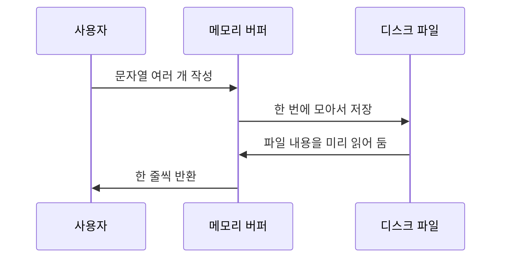

# 자바 문자 입출력과 버퍼링

이 자료는 [Solution07.java](/Users/baegseungho/IdeaProjects/260626_ex/src/Solution07.java)의 코드를 바탕으로 자바의 문자 입출력, 버퍼링, `Scanner` 입력 처리 개념을 정리한 문서입니다. 초심자용 가이드와 면접 대비용 내용으로 나누었습니다.

---

## 1. 초심자용 가이드 (For Beginners)

### 📄 이 코드는 무엇을 배우기 위한 예제인가요?
[Solution07.java](/Users/baegseungho/IdeaProjects/260626_ex/src/Solution07.java)는 텍스트 파일을 읽고 쓰는 방법을 보여줍니다.

- `BufferedWriter`로 텍스트 쓰기
- `BufferedReader`로 텍스트 읽기
- `Scanner`로 콘솔 입력 받기
- 입력한 여러 줄을 리스트에 모아서 파일로 저장하기

즉, "사람이 입력한 텍스트를 파일에 저장하고 다시 읽는 흐름"을 연습하는 코드입니다.

### 🔁 전체 흐름

```mermaid
flowchart TD
    A[main()] --> B[writeTextWithBuffer(file1)]
    B --> C[파일 file1.txt 작성]
    C --> D[readTextWithBuffer(file1)]
    D --> E[파일 내용 콘솔 출력]
    E --> F[useScannerWithBuffer(file2)]
    F --> G[콘솔에서 여러 줄 입력]
    G --> H[리스트에 저장]
    H --> I[file2.txt로 저장]
```

### 🧵 버퍼 스트림이란 무엇인가요?
버퍼는 데이터를 바로바로 디스크에 쓰지 않고, 메모리에 잠깐 모아 두었다가 한 번에 처리하는 공간입니다.

| 구분 | 버퍼 없이 처리 | 버퍼를 사용한 처리 |
| :--- | :--- | :--- |
| 쓰기 횟수 | 자주 발생 | 묶어서 처리 |
| 읽기 횟수 | 자주 발생 | 미리 읽어둠 |
| 속도 | 느릴 수 있음 | 보통 더 빠름 |
| 편의성 | 단순 | `readLine()`, `newLine()` 등 편리한 기능 제공 |

### 🧱 코드별 역할

#### 1) `writeTextWithBuffer()`
```java
try (BufferedWriter writer = Files.newBufferedWriter(Paths.get(file))) {
    writer.write("반갑습니다\n");
    writer.write("반갑습니다");
    writer.newLine();
    writer.write("JDK17+로 작업중");
}
```

- 파일에 텍스트를 씁니다.
- `newLine()`은 운영체제에 맞는 줄바꿈을 넣습니다.
- `try-with-resources`를 사용해서 닫기를 자동으로 처리합니다.

#### 2) `readTextWithBuffer()`
```java
try (BufferedReader reader = Files.newBufferedReader(path)) {
    String line;
    while ((line = reader.readLine()) != null) {
        System.out.println(line);
    }
}
```

- 한 줄씩 읽어 옵니다.
- `readLine()`은 줄바꿈 문자를 제외한 문자열을 돌려줍니다.

#### 3) `useScannerWithBuffer()`
```java
try (Scanner sc = new Scanner(System.in)) {
    while (true) {
        String input = sc.nextLine();
        if (input.equals("w")) {
            break;
        }
        lines.add(input);
    }
}
```

- 콘솔에서 한 줄씩 입력받습니다.
- 입력값이 `w`이면 종료합니다.
- 입력한 줄들을 `List<String>`에 모아둡니다.
- 마지막에 `BufferedWriter`로 파일에 저장합니다.

### 📊 핵심 개념 비교표

| 개념 | 설명 | 코드에서의 사용처 |
| :--- | :--- | :--- |
| `BufferedReader` | 텍스트를 효율적으로 읽는 보조 스트림 | `readTextWithBuffer()` |
| `BufferedWriter` | 텍스트를 효율적으로 쓰는 보조 스트림 | `writeTextWithBuffer()`, `useScannerWithBuffer()` |
| `Scanner` | 콘솔 입력을 쉽게 받는 클래스 | `useScannerWithBuffer()` |
| `Files.newBufferedReader()` | 경로 기반으로 버퍼 읽기 객체 생성 | 파일 읽기 |
| `Files.newBufferedWriter()` | 경로 기반으로 버퍼 쓰기 객체 생성 | 파일 쓰기 |

### 📌 왜 `BufferedReader`와 `BufferedWriter`를 쓰나요?
기본 파일 입출력은 매번 디스크 접근이 일어나면 느립니다. 버퍼를 쓰면 메모리에 모았다가 처리하므로 더 효율적입니다.



---

## 2. 면접 대비용 가이드 (For Interview)

### 📌 Q1. `BufferedReader`와 `BufferedWriter`를 왜 쓰나요?
* **답변**: 디스크 I/O 횟수를 줄여 성능을 높이기 위해 사용합니다. 버퍼가 메모리에서 데이터를 먼저 모으고, 일정량이 쌓이거나 flush 시점이 되면 한 번에 읽거나 씁니다. 또한 `BufferedReader.readLine()`과 `BufferedWriter.newLine()` 같은 편의 메서드를 제공합니다.

### 📌 Q2. `Files.newBufferedReader()`와 `FileReader`의 차이는 무엇인가요?
* **답변**: `Files.newBufferedReader()`는 `Path` 기반 API로 `BufferedReader`를 바로 생성하며, 인코딩을 명시할 수 있어 더 현대적입니다. `FileReader`는 전통적인 클래스이고, 문자 단위 처리를 하더라도 인코딩 명시 측면에서 불리할 수 있습니다. 실무에서는 `Files`와 `Path` 기반 API를 우선 고려합니다.

### 📌 Q3. `Scanner`를 콘솔 입력에 쓸 때 장단점은 무엇인가요?
* **답변**: 장점은 사용이 쉽고 `nextLine()`, `nextInt()` 같은 메서드로 다양한 타입 입력을 처리할 수 있다는 점입니다. 단점은 대용량 텍스트 처리 성능이 `BufferedReader`보다 떨어질 수 있고, 토큰 단위/줄 단위 입력 혼용 시 줄바꿈 처리 이슈가 생길 수 있다는 점입니다.

### 📌 Q4. `try-with-resources`가 중요한 이유는 무엇인가요?
* **답변**: `BufferedReader`, `BufferedWriter`, `Scanner` 같은 자원은 닫지 않으면 파일 핸들 누수나 리소스 고갈이 생길 수 있습니다. `try-with-resources`는 예외가 나더라도 자동으로 `close()`를 호출하므로 안전하고 코드도 짧습니다.

### 📌 Q5. 이 코드에서 예외 처리를 `RuntimeException`으로 다시 던지는 이유는 무엇인가요?
* **답변**: 입출력 실패를 호출자에게 숨기지 않고 상위로 빠르게 전파하기 위한 방식입니다. 예외를 삼키지 않고 원인을 보존한 채 던지면, 상위 계층에서 통합적으로 처리하거나 로그를 남기기 쉽습니다.

### 📌 Q6. 텍스트 파일 저장에서 `newLine()`을 쓰는 이유는 무엇인가요?
* **답변**: 운영체제마다 줄바꿈 문자가 다르기 때문입니다. `newLine()`은 플랫폼에 맞는 줄바꿈을 사용하므로, 윈도우와 유닉스 계열 모두에서 호환성이 좋아집니다.

