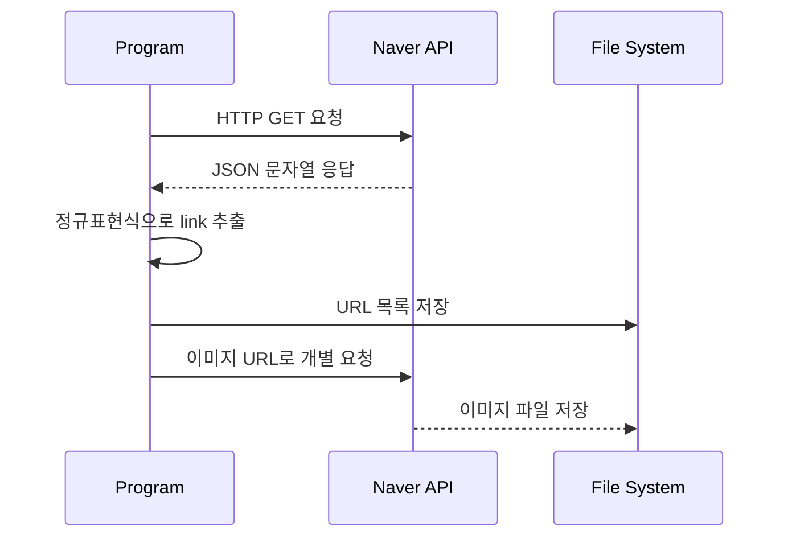
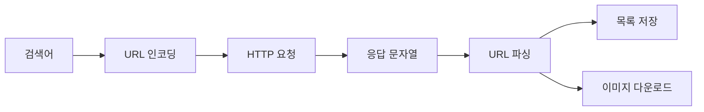

# 자바 HTTP 통신, 문자열 파싱, 파일 저장

이 자료는 [Solution08.java](/Users/baegseungho/IdeaProjects/260626_ex/src/Solution08.java)의 코드를 바탕으로 자바 `HttpClient`, URL 인코딩, 정규표현식, 파일 저장, 이미지 다운로드 흐름을 정리한 문서입니다. 초심자용 가이드와 면접 대비용 내용으로 나누었습니다.

---

## 1. 초심자용 가이드 (For Beginners)

### 🌐 이 코드는 무엇을 하는 예제인가요?
[Solution08.java](/Users/baegseungho/IdeaProjects/260626_ex/src/Solution08.java)는 네이버 이미지 검색 API를 호출해서:

1. 이미지 URL 목록을 가져오고
2. URL 목록을 텍스트 파일로 저장하고
3. 실제 이미지 파일도 다운로드합니다.

즉, "외부 HTTP API 호출 -> 응답 파싱 -> 파일 저장 -> 이미지 다운로드"까지 한 번에 연결한 예제입니다.

### 🔁 전체 흐름

```mermaid
flowchart TD
    A[main()] --> B[getImageUrlList(keyword)]
    B --> C[네이버 이미지 검색 API 호출]
    C --> D[응답 본문에서 URL 추출]
    D --> E[saveUrlList(urlList, keyword)]
    E --> F[텍스트 파일로 URL 목록 저장]
    D --> G[downloadImages(urlList, keyword)]
    G --> H[각 URL을 실제 이미지 파일로 저장]
```

### 📡 `HttpClient`란 무엇인가요?
`HttpClient`는 자바 11+에서 제공하는 HTTP 통신 도구입니다.

| 구분 | 설명 |
| :--- | :--- |
| `HttpClient` | HTTP 요청을 보내는 클라이언트 |
| `HttpRequest` | 보낼 요청 정보 |
| `HttpResponse` | 응답 결과 |
| `BodyHandlers.ofString()` | 응답 본문을 문자열로 받음 |
| `BodyHandlers.ofFile(path)` | 응답 본문을 파일로 저장 |

### 🧾 코드별 역할

#### 1) API 호출 준비
```java
String clientId = System.getenv("NAVER_CLIENT_ID");
String clientSecret = System.getenv("NAVER_CLIENT_SECRET");
```

- 환경 변수에서 인증 정보를 가져옵니다.
- 값이 없으면 API를 호출할 수 없습니다.

#### 2) URL 인코딩
```java
URLEncoder.encode(keyword, StandardCharsets.UTF_8)
```

- 검색어에 한글이나 공백이 있으면 URL 규칙에 맞게 변환해야 합니다.
- 예: `"창억떡"` 같은 한글 검색어도 안전하게 보낼 수 있습니다.

#### 3) HTTP 요청 보내기
```java
HttpRequest request = HttpRequest.newBuilder()
    .uri(URI.create(url))
    .headers("X-Naver-Client-Id", clientId, "X-Naver-Client-Secret", clientSecret)
    .build();
```

- 요청 URL과 헤더를 설정합니다.
- 헤더에는 인증 정보를 넣습니다.

#### 4) 응답 문자열에서 URL 추출
```java
Pattern pattern = Pattern.compile("\"link\":\"(.*?)\"");
for (MatchResult matchResult : pattern.matcher(body).results().toList()) {
    urlList.add(matchResult.group(1).replace("\\/", "/"));
}
```

- 응답 JSON 문자열에서 `"link"` 값을 찾습니다.
- 정규표현식을 사용해서 이미지 URL을 추출합니다.
- `\/` 형태를 `/`로 바꿔서 실제 URL처럼 다룹니다.

#### 5) URL 목록 파일 저장
```java
try (BufferedWriter writer = Files.newBufferedWriter(path)) {
    for (String url : urlList) {
        writer.write(url);
        writer.newLine();
    }
}
```

- URL들을 한 줄씩 텍스트 파일에 저장합니다.
- 나중에 다시 읽어오거나 재사용하기 쉽습니다.

#### 6) 이미지 파일 다운로드
```java
HttpResponse<Path> response = httpClient
        .send(request, HttpResponse.BodyHandlers.ofFile(path));
```

- 응답 본문을 바로 파일로 저장합니다.
- 이미지 파일을 메모리에 다 올리지 않고 바로 저장할 수 있어 편리합니다.

### 📊 핵심 개념 비교표

| 개념 | 설명 | 코드에서의 사용처 |
| :--- | :--- | :--- |
| `HttpClient` | HTTP 요청/응답 처리 | API 호출, 이미지 다운로드 |
| `HttpRequest` | 요청 구성 객체 | URL, 헤더 설정 |
| `HttpResponse` | 응답 결과 객체 | 문자열 응답, 파일 응답 |
| `URLEncoder` | URL 안전 인코딩 | 검색어 처리 |
| `Pattern` / `MatchResult` | 정규표현식 처리 | URL 추출 |
| `BufferedWriter` | 텍스트 파일 저장 | URL 목록 저장 |
| `BodyHandlers.ofFile()` | 응답을 파일로 저장 | 이미지 다운로드 |

### 🧠 API 응답 처리 흐름



---

## 2. 면접 대비용 가이드 (For Interview)

### 📌 Q1. `HttpClient`를 쓸 때 `HttpRequest`, `HttpResponse`는 각각 어떤 역할인가요?
* **답변**: `HttpRequest`는 보낼 요청의 메타데이터를 담는 객체이고, `HttpResponse`는 서버가 돌려준 응답을 담는 객체입니다. `HttpClient`는 둘 사이를 연결하는 실행 주체입니다.

### 📌 Q2. 왜 `URLEncoder.encode()`를 사용하나요?
* **답변**: URL에는 허용되지 않는 문자나 공백, 한글이 포함될 수 있기 때문입니다. 검색어를 그대로 URL에 넣으면 요청이 깨질 수 있으므로, UTF-8 기준으로 안전한 문자열로 인코딩해야 합니다.

### 📌 Q3. 이 코드에서 JSON 파서를 쓰지 않고 정규표현식을 사용한 이유는 무엇인가요?
* **답변**: 예제 수준에서는 구조가 단순하고 빠르게 값을 추출할 수 있기 때문입니다. 다만 실무에서는 응답 구조가 복잡하거나 필드가 중첩될 수 있으므로 `Jackson`, `Gson` 같은 JSON 파서를 쓰는 것이 더 안전합니다.

### 📌 Q4. 정규표현식으로 JSON을 파싱하는 방식의 한계는 무엇인가요?
* **답변**: JSON 문자열의 이스케이프, 중첩 구조, 필드 순서 변경에 취약합니다. 응답 형식이 조금만 바뀌어도 패턴이 깨질 수 있어 유지보수성이 낮습니다. 따라서 정규표현식은 임시 처리나 학습용 예제에 가깝습니다.

### 📌 Q5. `BodyHandlers.ofFile()`의 장점은 무엇인가요?
* **답변**: 응답 본문을 바로 파일로 저장하므로 대용량 바이너리 데이터를 메모리에 모두 올리지 않아도 됩니다. 이미지, PDF, 압축 파일 같은 다운로드 작업에 적합합니다.

### 📌 Q6. 이미지 URL에서 확장자를 추출할 때 주의할 점은 무엇인가요?
* **답변**: URL 경로가 항상 단순한 파일명 형태는 아니므로, 단순히 `split("\\.")`만으로는 예외가 생길 수 있습니다. 쿼리 스트링, 리다이렉트, 확장자 없는 URL 등을 고려해야 하며, 확장자가 너무 길면 비정상 값으로 판단하는 방어 로직이 필요합니다.

### 📌 Q7. 환경 변수를 사용하는 이유는 무엇인가요?
* **답변**: API 키나 비밀값을 코드에 직접 쓰지 않기 위해서입니다. 소스에 자격 증명이 남지 않으므로 보안과 배포 유연성이 좋아집니다.

### 📌 Q8. 이 코드의 처리 단계는 어떤 아키텍처 관점으로 볼 수 있나요?
* **답변**: 외부 API 호출, 응답 처리, 파일 저장, 이미지 다운로드가 분리된 작은 파이프라인으로 볼 수 있습니다. 각 단계가 독립적이어서 나중에 JSON 파싱으로 교체하거나 저장 형식을 바꾸기 쉽습니다.



